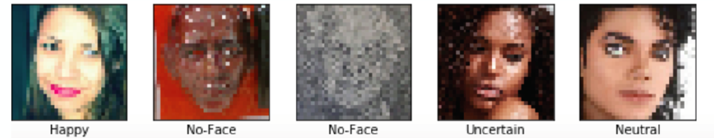

# Facial Expression Recognition Using Deep Learning 
Divya Periyakoil, Isabella Maceda, John Xinyu Lin, Brandon Scolieri

## Abstract
Affect is a term that describes the outward expression of emotion and feelings [1]. Facial expression recognition (FER) or facial affect recognition (FAC) is the process of classifying human affect in facial image data. Automated affective computing achieved through FER is a challenging problem in the field of image classification due to the high variability of in-the-wild images. A subset of the factors that contribute to the complexity of this problem include variations in: image dimension, photograph angle, image lighting, background image data, and the human ability to express a wide range of facial expressions for any given categorical affect. Due to the multi-dimensional nature of this problem, we chose to approach this challenge by implementing a deep neural network architecture that leverages the power of deep learning to automatically capture the highly nuanced features of facial image data.

## Background

Facial expression recognition continues to be an important and persistent problem in the fields of computer vision and artificial intelligence; with significant applications in robotics (especially human-robot interaction), treatment of neurological disabilities, sentiment analysis, and more. Furthermore, considering that approximately two-thirds of human communication occurs through non-verbal expressions [4], having the ability to accurately assess image data with FER would facilitate significantly more robust interactions between humans and machines. Some practical examples of systems that could utilize this functionality include augmented reality systems and automated learning systems that label emotions for people affected by disabilities such as Autism, which can impair an individual’s ability to recognize facial emotions on their own. With the advent of better computational resources and image data in recent decades, researchers have been examining and developing neural-network approaches toward FER [2]. Unlike traditional approaches, which often utilize a discrete and relatively simple set of hand-crafted facial image features [4], deep learning approaches instead learn these features via neural networks. This approach often yields improved performance, especially on novel and in-the-wild image data [2]. This improvement on in-the-wild image classification using DNN’s can largely be attributed to the fact that traditional models lack the necessary feature complexity and are tailored toward facial images taken in controlled environments. These characteristics render inelastic networks that cannot adequately generalize and adapt to other images from other environments (including other controlled environments as well as uncontrolled, (i.e. “in-the-wild”) images) [2]. State-of-the-art algorithms using neural network approaches have generally good results, with some models achieving over 90% accuracy on controlled-environment facial databases, and others achieving around 82% on in-the-wild images [1].  

Our goal was to design a FER system, using deep learning, that can identify the affect present in images of human faces. To accomplish this we began by constructing a convolutional neural network with residual layers to categorize static in-the-wild images of faces from the AffectNet database into eleven discrete affect categories.  

While some models include continuous features such as valence and arousal, which quantify levels of sentiment (i.e. positivity/negativity of an image) and intensity of response (i.e. excitement/calmness of an image) respectively [1], we chose to allow the network to learn these features on its own and focus on categorizing emotions into discrete classes. To measure our performance, we assess model accuracy on held-out validation data.  

## AffectNet and Data Processing  

The original AffectNet dataset is comprised of approximately 1,000,000 in-the-wild facial images that were gathered by querying Google, Bing, and Yahoo using 1,250 emotion related tags in English, Spanish, Portuguese, German, Arabic, and Farsi. About half of the original dataset was manually categorized into the following eleven discrete categories: neutral, happy, sad, surprise, fear, disgust, anger, contempt, none, uncertain, and non-face. The data was obtained directly from the AffectNet team. The image dimensions vary and the distribution of images by category is not uniform. In addition, the dataset contained .csv files that describe the file path, class label, and some information that was not used for this project such as, valence and arousal. 

Due to computational limitations we used a manually labeled subset of approximately 394,000 facial images, which were sampled from the complete AffectNet dataset. The labels from the manually annotated images served as the ground truth for our models. For housing the data we decided to use Google Drive since it provided sufficient storage capacity for free. Since we were housing the data using Google Drive we used Google Collaboratory’s access to free GPU resources as a means for performing and accelerating the training computation. We found that there are significant drawbacks to using both of these free services, which will be elaborated on in the *Lesssons Learned* section.  
 
After obtaining the data, we preprocessed the images to scale them down to uniform dimensions that were within the parameters of the memory limitations imposed by Google Collaboratory. Despite using only a fraction of the dataset, with over 394,000 images we still had to account for the computation time required to preprocess the images. To complete the preprocessing phase we used the Python Image Library (PIL) to resize each of the images to dimensions of 32x32. Following that, each image was converted into a tensor of dimensions 32x32x3, where 32x32 represents the image dimensions in pixels, and 3 represents the number of color channels. We utilized multithreading to ameliorate the preprocessing time.

| Labeled Affect Category | Neutral | Happy   | Sad   | Surprise | Fear  | Disgust | Anger  | Contempt | None   | Uncertain | Non-face |
|------------------------:|---------|---------|-------|----------|-------|---------|--------|----------|--------|-----------|----------|
| Number of images        | 71,053  | 125,734 | 24658 | 13,512   | 6,211 | 3,676   | 23,872 | 3,530    | 31,769 | 11,286    | 78,751   |

*Figure 1. Distribution of images by category. Total images: 394,052*

*Figure 2. Examples of preprocessed images, scaled down to 32x32 pixels.*

## Model Architectures

In the process of creating our final model, we created over 10 different models. The models below show the progression of how we tweaked the intermediate models and arrived at our final model. Each model used a batch size of 128 and had an input shape of 128x32x32x3.  

1.	The first model we applied was a simplistic convolutional neural network comprised of convolutions of sized 32, 64, 128 and 256; max pooling; and a dense layer of dimension 512. We noticed that the model was severely overfitting the data, which was made evident by our high training accuracy and low validation accuracy. After approximately 15 to 20 epochs the validation accuracy plateaued at around 25%.  

*Figure 2. An overview of our architecture for the second and third iterations. Blue rectangular prisms represent regular convolutional layers.*

2.	Using the stacked convolution model as our baseline we augmented this initial model further in our next iteration by adding 5 residual layers of dimension 256 after the convolution stack. Our motivation for adding residual layers was to counter the overfitting we saw in our first benchmark model. Each residual layer consisted of a linear activation, convolutional layers, a relu activation, and an addition layer. The input and output sizes were of 128x32x32x256. This improved our validation accuracy to 29.7%. We also attempted to interweave residual and convolutional layers but found that led to increased overfitting.  

3.	In our third iteration, we noted the severe imbalance of the number of photos belonging to each class. For example, the happy category had nearly 30 times more photos than the disgust category. This presented issues while training the model, as we sampled 5000 images per epoch. Thus, we decided to sample max(10,000, all of the images) from each category and make this the training set instead. This made the training set more balanced and fair toward every category in the dataset. We also centered our images (normalized them) and we saw a considerable increase in our validation accuracy, to 36.32%. 

*Figure 2. An overview of our architecture for the second and third iterations. Blue rectangular prisms represent regular convolutional layers.*

The AffectNet dataset also included ResNeXt (aggregated residual) networks for annotating images under the categorical model (with the 11 aforementioned categories) and the valence and arousal model; these models were used to automatically annotate the remaining 550,000 plus images (which we did not use). We took inspiration from their categorical model when coming up with our own model, but otherwise did not base our model off their architecture. However, we did train their model, with slight modifications, for comparison purposes, which we describe in our concluding discussion.

## Results
WIn the process of creating our final model, we created over 10 different models before creating our final model. The models listed below show the progression of how we tweaked the intermediate models and arrived at our final model. Each model was implemented from scratch using the machine learning libraries Keras and Tensorflow and used a batch size of 128 and had an input shape of 128x32x32x3.

The first model we triedapplied was a simplesimplistic convolutional neural network comprised of convolutions of sizesized 32, 64, 128 and 256; max pooling; and a dense layer of dimension 512. We noticed that the model was severely overfitting ourthe data, which was made evident fromby our high training accuracy and low validation accuracy. After approximately 15 to 20 epochs, the validation accuracy plateaued at around 25%. 

*Figure 4. Losses for our basic model for the first 100 epochs. While training loss continues to go down, validation loss does not.*

*Figure 5. Accuracies for our basic model for the first 100 epochs. Notice how validation accuracy tends to hover around 25% after 20 epochs. Training accuracy continues to rise, indicating clear overfitting.*

Using the stacked convolution model as our baseline, we augmented this initial model further in our next iteration by adding 5 residual layers of dimension 256 after the convolution stack. Our motivation for adding residual layers was to counter the overfitting we saw in our first benchmark model. Each residual layer consisted of a linear activation, convolutional layers, a ReLUrelu activation, and finallying an addition layer. The input and output sizes were of 128x32x32x256. This improved our validation accuracy to 29.7%. We also attempted to interweave residual and convolutional layers but found that doing so led to increased overfitting. 

*Figure 6. Losses for our second model for the first 25 epochs. Both training and validation losses seem to stabilize, but validation loss shows more variance.*

*Figure 7. Accuracies for the second model for the first 25 epochs, approaching 30% validation accuracy. While we have not shown all epochs, already we notice plateauing in validation accuracy.*

In our third iteration, we noted the severe imbalance of the number of photos belonging to each class. For example, the "happy category," with 125,734 images, had nearly 30 times more photos than the "disgust category," which only had 3,676 photos. This presented issues while training the model, as we sampled 5000 images per epoch. Thus, we decided to sample max(5000, all of the images) from each category and make this the training set instead. This made the training set more balanced and fair toward every category in the dataset. As a result, wWe saw a considerable increase in our validation accuracy, to 35.6%. 

## Project Challenges
The first challenge we encountered in pursuing our project was the time to download, extract and upload the data. Doing so took longer than we expected, which delayed the amount of time and resources left for processing and training our models. Another challenge that our team faced was Google Colab’s RAM limitation. This limited the number of epochs we could run and the number of steps per epoch that we could use. 
One of our worst performing models, placed a ReLUrelu activation at the end of our model, causing an inordinate amount of overfitting because it made our gradients vanish for all negative inputs.

## Moving Forward
In the future, we hope to improve our model by using some of the following methods: whitening, batch normalization (a more effective use of batch normalization), layer normalization, and gated tanh units. 

## Conclusion
As we have learned, designing a neural network that accurately categorizes facial emotions is not an easy task, especially given our computational constraints. While we have not reached accuracies comparable to other state-of-the-art algorithms (from our introductory discussion), we have learned the following lessons:
Using residual layers helps increase our model performance. First espoused by He et al. in their paper “Deep Residual Learning for Image Recognition,” residual connections have enabled deeper architectures that have demonstrated better performance compared to their non-residual counterparts [3]. By mitigating the training accuracy degradation (described in He et al.'s experiments) that usually occurs with an increased number of layers, deeper models become faster to train, and result in better accuracies overall [3]. Hence, we decided to add residual layers to give our network more representation power while preserving accuracy.
Our dataset can significantly affect our overall performance. Initially, we had ignored the severe imbalance among our training images, and simply decided to train our model anyway. However, as two of our graduate student instructors pointed out (see acknowledgements), doing so can adversely affect our model's performance, especially if it learns to favor one class over another. With that in mind, we decided to make the changes mentioned above for our third major model iteration.
With better computing resources, our model may be promising. Apart from developing our own model, we ran the ResNeXt model provided with the AffectNet dataset, only changing the network's image input size to 32x32x3 (as we have downscaled our images, as mentioned above). Running the model for around 15 epochs gives us a validation accuracy of around 25%, comparable to our first model iteration, and worse than our second and third iterations (respectively around 30% and 35%). The AffectNet documentation states that their ResNeXt model has an average accuracy of 65%; however, that accuracy is over the span of 200 epochs. With more training time and memory, perhaps our model can also reach similar accuracies, if not greater.

## Team Contributions
Teammate: Sections contributed | % Contributed  

Divya Periyakoil: Research, Modeling, Poster, Report, Visualizations | 25%  

Brandon Scolieri: Research, Modeling, Poster, Report, Visualizations | 25%  

Isabella Maceda: Research, Modeling, Poster, Report, Visualizations  | 25%  

John Xinyu Lin: Research, Modeling, Poster, Report, Visualizations   | 25%  

## Acknowledgements
We would like to acknowledge David Chan, our advising graduate student instructor, for guiding us through  our project. Additionally, we would like to recognize Professor John Canny for teaching the course and givinge us guidance on how to improve our model’s performance, as well as Phillipe Laban, a graduate student instructor, who gave us instrumental advice to improveameliorate our model during our poster session. 

## Bibliography
[1] A. Mollahosseini; B. Hasani; M. H. Mahoor, "AffectNet: A Database for Facial Expression, Valence, and Arousal Computing in the Wild," in IEEE Transactions on Affective Computing, 2017.

[2] A. Mollahosseini, D. Chan and M. H. Mahoor, "Going deeper in facial expression recognition using deep neural networks," 2016 IEEE Winter Conference on Applications of Computer Vision (WACV), Lake Placid, NY, 2016, pp. 1-10. doi: 10.1109/WACV.2016.7477450

[3] He, Kaiming et al. “Deep Residual Learning for Image Recognition.” 2016 IEEE Conference on Computer Vision and Pattern Recognition (CVPR) (2016): 770-778.

[4] Ko, Byoung Chul. “A Brief Review of Facial Emotion Recognition Based on Visual Information.” Sensors (Basel, Switzerland) vol. 18,2 401. 30 Jan. 2018, doi:10.3390/s18020401

